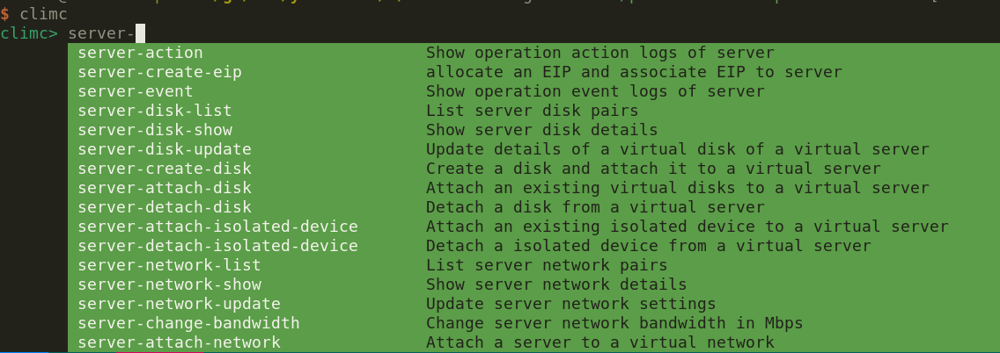
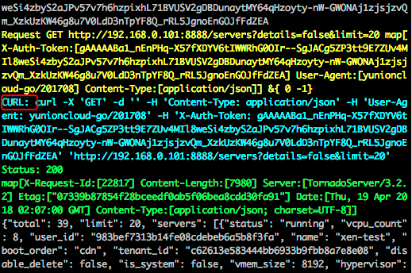

云平台的命令行管理工具是 `climc`, 可以通过该工具向后端各个服务发送API请求, 实现对资源的操控。

通过快速开始的[All in One安装](../../quickstart/allinone/)或[安装部署](../../setup)章节搭建开源版OneCloud环境时，控制节点都会安装climc，可直接跳过安装climc章节直接查看使用climc章节。

下面介绍如何在非控制节点上安装climc。

## 安装

可以通过 yum 或者源码编译的方式安装climc。

### RPM 安装

添加 yunion 的 yum 源，如果已经添加可以忽略这一步。

```bash
$ cat <<EOF >/etc/yum.repos.d/yunion.repo
[yunion]
name=Packages for Yunion Multi-Cloud Platform
baseurl=https://iso.yunion.cn/yumrepo-3.2
sslverify=0
failovermethod=priority
enabled=1
gpgcheck=0
EOF
```

安装 climc

```bash
$ sudo yum install -y yunion-climc
$ ls -alh /opt/yunion/bin/climc
-rwxr-xr-x 1 root root 24M Jul 18 19:04 /opt/yunion/bin/climc
```

### 源码编译安装

首先需要搭建 go 的开发环境，然后 clone 代码，参考: [开发贡献](/contribute/)


```bash
# 编译 climc
$ cd $GOPATH/src/yunion.io/x/onecloud
$ make cmd/climc

# 等待编译完成后，climc 在 _output/bin 目录下
$ ls -alh _output/bin/climc
-rwxr-xr-x 1 lzx lzx 25M Jul 15 17:10 _output/bin/climc
```

可以根据自己的需要，将编译好的 climc 放到对应的目录，或者直接写 alias 对应到 $GOPATH/src/yunion.io/x/onecloud/_output/bin/climc 。

## 使用

安装好 climc 后，可以将对应的可执行目录加入到 PATH 环境变量，下面假设 climc 所在的目录是 /opt/yunion/bin 。

```bash
# 根据自己的需要加到 bash 或者 zsh 配置文件里面
$ echo 'export PATH=$PATH:/opt/yunion/bin' >> ~/.bashrc && source ~/.bashrc
$ climc --help
```

### 认证配置

climc 请求云平台后端服务的流程如下:

1. 通过配置信息，使用用户名密码从 keystone 获取 token
2. token 中包含了后端服务的 endpoint 地址
3. climc 将对应资源的 CURD 请求发往所属的后端服务

所以在操作资源前，我们需要通过环境变量告诉 climc 想要操作的云平台和认证信息。

目前climc支持两种认证方式：

- 通过用户名／密码认证
- 通过Access Key／Secret认证（从2.11开始支持） 

#### 控制节点认证配置

在控制节点上可直接通过以下命令认证配置。

```bash
# 获取环境变量
$ ocadm  cluster rcadmin
export OS_AUTH_URL=https://192.168.0.246:5000/v3
export OS_USERNAME=sysadmin
export OS_PASSWORD=3hV3***84srk
export OS_PROJECT_NAME=system
export YUNION_INSECURE=true
export OS_REGION_NAME=region0
export OS_ENDPOINT_TYPE=publicURL

# 认证环境变量
$ source <(ocadm cluster rcadmin)
```
注意: 如果执行 climc 时出现 *Error: Missing OS_AUTH_URL* 的错误提示时，请重新执行 `source <(ocadm cluster rcadmin)` 命令。

#### 非控制节点认证配置

在非控制节点做认证配置上首先需要在对应的控制节点上获取相关参数，并将认证信息保存到文件中，通过source命令认证配置。

以下为用户名／密码认证的配置文件模板，通过OS_USERNAME, OS_DOMAIN_NAME, OS_PASSWORD, OS_PROJECT_NAME, OS_PROJECT_DOMAIN等字段指定用户的信息和项目的信息。

```bash
# 在控制节点上获取认证所需要的配置信息。
# ocadm cluster rcadmin
export OS_AUTH_URL=https://192.168.0.246:5000/v3
export OS_USERNAME=sysadmin
export OS_PASSWORD=3hV3***84srk
export OS_PROJECT_NAME=system
export YUNION_INSECURE=true
export OS_REGION_NAME=region0
export OS_ENDPOINT_TYPE=publicURL

# 将认证信息保存到文件中，方便 source 使用
$ cat <<EOF > ~/test_rc_admin
# 用户名
export OS_USERNAME=sysadmin
# 用户所属域名称(如果为Default域,可以省略)
export OS_DOMAIN_NAME=Default
# 用户密码
export OS_PASSWORD=***
# 用户所属项目名称
export OS_PROJECT_NAME=system
# 项目所属域名称(如果为Default域,可以省略)
export OS_PROJECT_DOMAIN=Default
# keystone 认证地址
export OS_AUTH_URL=https://192.168.0.246:5000/v3
# 对应的 region
export OS_REGION_NAME=Beijing
EOF

```

以下为Access Key/Secret认证的配置文件模板，通过OS_ACCESS_KEY, OS_SECRET_KEY等两个字段指定用户的Access Key/secret。

```bash
# 将认证信息保存到文件中，方便 source 使用
$ cat <<EOF > ~/test_rc_admin
# Access Key
export OS_ACCESS_KEY=0d184a3c9c484e4c892f4855935e37e7  
# Secret
export OS_SECRET_KEY=VG***5mUXM=
# keystone 认证地址
export OS_AUTH_URL=https://192.168.0.246:5000/v3
# 对应的 region
export OS_REGION_NAME=Beijing
EOF

# 在控制节点上获取用户在一个项目中的Access Key/Secret

# 生成 Secret Key
$ climc credential-create-aksk
+--------+----------------------------------------------+
| Field  |                    Value                     |
+--------+----------------------------------------------+
| expire | 0                                            |
| secret | VGFxZkE3QTd2MmhCbmZkVkJDcFZFaGJYdUQ2c05mUXM= |
+--------+----------------------------------------------+

# ID为 Access Key
$ climc credential-list
+-----------------------+------------+------------+-----------------------+---------+---------+-----------+---------+-----------------------+-------------+--------------+-----------------------+------+-----------------------+----------------------+----------+----------------------+
|         blob          | can_delete | can_update |      created_at       | deleted | domain  | domain_id | enabled |          id           | is_emulated |     name     |      project_id       | type |    update_version     |      updated_at      |   user   |       user_id        |
+-----------------------+------------+------------+-----------------------+---------+---------+-----------+---------+-----------------------+-------------+--------------+-----------------------+------+-----------------------+----------------------+----------+----------------------+
| {"expire":0,"secret": | true       | true       | 2020-06-15T11:43:32.0 | false   | Default | default   | true    | 0d184a3c9c484e4c892f4 | false       | --1592221412 | d53ea650bfe144da8ee8f | aksk | 0                     | 2020-06-15T11:43:32. | sysadmin | a063d8e2cd584cc48194 |
| "VGFxZkE3QTd2MmhCbmZk |            |            | 00000Z                |         |         |           |         | 855935e37e7           |             |              | 3fba417b904           |      |                       | 000000Z              |          | 5e7169280435         |
| VkJDcFZFaGJYdUQ2c05mU |            |            |                       |         |         |           |         |                       |             |              |                       |      |                       |                      |          |                      |
| XM="}                 |            |            |                       |         |         |           |         |                       |             |              |                       |      |                       |                      |          |                      |
+-----------------------+------------+------------+-----------------------+---------+---------+-----------+---------+-----------------------+-------------+--------------+-----------------------+------+-----------------------+----------------------+----------+----------------------+
***  Total: 1 Pages: 1 Limit: 2048 Offset: 0 Page: 1  ***

```
模板配置完成后，通过以下名称认证环境变量。

```bash
# source 认证环境变量
$ source ~/test_rc_admin

# 执行climc。例如，查看虚拟机列表
$ climc server-list
```

注意: 如果执行 climc 时出现 *Error: Missing OS_AUTH_URL* 的错误提示时，请 source 或设置认证云平台的环境变量。

可以通过查看 climc 的版本号来获取构建的信息。

```bash
$ climc --version
Yunion API client version:
 {
  "major": "0",
  "minor": "0",
  "gitVersion": "v3.1.9-20200609.1",
  "gitBranch": "tags/v3.1.8^0",
  "gitCommit": "5591bbec4",
  "gitTreeState": "clean",
  "buildDate": "2020-06-09T12:00:48Z",
  "goVersion": "go1.13.9",
  "compiler": "gc",
  "platform": "linux/amd64"
}
```

### 运行模式

climc 有命令行运行和交互两种运行模式。

- 命令行运行: 执行完对应的资源操作命令就退出，这种模式你知道自己在做什么，并且可以作为 bash function/script 的一部分。

```bash
# 删除 server1, server2, server3
for id in server1 server2 server3; do
	climc server-update --delete enable $id
	climc server-delete $id
done
```

- 交互模式: 在 shell 输入 climc，就会进入交互模式，这种模式下有自动补全和参数提示。


### 子命令语法

云平台有很多资源，对应 climc 的子命令, 比如 `climc server-list` 中的 `server-list` 就是子命令，可以查询虚拟机的列表。通用格式如下:

```bash
<Resource>-<Action>: Resource 表示资源, Action 表示行为
```

语法举例:

- server-delete: 删除虚拟机
  - server 是资源, delete 是行为
- host-list: 查询宿主机列表
  - host 是资源, list 是行为

CRUD 举例:

- *C*: server-create, disk-create 创建资源
- *R*: server-show, disk-list 查询资源
- *U*: server-update, host-update 更新资源
- *D*: server-delete, image-delete 删除资源

行为举例:

<Resource>-<Action> 中的 Action 会对应资源的操作，不同的资源会根据可进行的操作进行命名。

- server-migrate: migrate 表示迁移虚拟机
- server-change-config: change-config 表示调整虚拟机配置
- host-ipmi: ipmi 表示查询宿主机的 IPMI 信息

想要知道资源有哪些操作，可以进入交互模式补全查询。

### 使用帮助 help

climc 的子命令有很多参数，参数分为必填参数和可选参数，使用 `climc help <subcommand>` 这种格式，**help** 子命令会获取 <subcommand> 提供的参数和各个参数的解释。

比如我要查看 `image-upload` 命令的参数和解释:

```bash
$ climc help image-upload
...
Upload a local image

Positional arguments:
    <NAME>
        Image Name
    <FILE>
        The local image filename to Upload

Optional arguments:
    [--private]
        Make image private
    [--format {raw,qcow2,iso,vmdk,docker,vhd}]
        Image format
    [--protected]
...
```

### 高级过滤 filter

TODO

### Debug 模式

如果想要知道 climc 操作资源时究竟和服务端发生了哪些请求，可以在子命令前面使用 *--debug* 参数，使用方式如下:

```bash
climc --debug <Resource>-<Action>
```

加上 --debug 参数后，终端会有彩色的输出提示，比如 `climc --debug server-list` 输出如下:



其中 CURL 部分是可以直接粘贴出来在命令行执行的。

#### 颜色约定

- Request 使用黄色
- CURL 使用蓝绿色
- 根据状态码显示不同颜色，可参考代码: https://github.com/yunionio/onecloud/blob/master/pkg/util/httputils/httputils.go#L234

#### 在bash或zsh下的命令行参数提示补全
climc支持bash或zsh的命令行参数自动提示补全。

下面以bash为例说明，在使用climc之前，执行如下命令初始化环境。

```bash
# 启用bash命令行参数自动补全
source <(climc --completion bash)
```

之后在bash中可以在输入climc命令后，通过tab获得命令行参数的提示。

为了方便使用，推荐将该命令放到$HOME/.bashrc或$HOME/.bash_profile中自动初始化环境。
